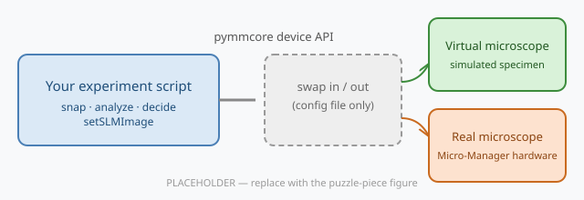

# virtual-microscope-teaching

A **minimal virtual microscope for learning smart microscopy**: a simulated, light-responsive specimen behind the same device API ([pymmcore-plus](https://github.com/pymmcore-plus/pymmcore-plus) / Micro-Manager) that controls real microscopes.

> **The point:** the simulator models the *microscope–code interaction*, not the biology. It lets you develop, debug, and teach image-processing pipelines and microscope control logic in minutes on any laptop, then swap in a real microscope by changing only the configuration.



Code written against the virtual microscope runs unchanged on real hardware: `core.snapImage()`, `core.setConfig("Channel", ...)`, `core.setSLMImage(...)` are the identical calls in both worlds, because both implement the same Micro-Manager core API.

This package accompanies the NEUBIAS [training-resources](https://neubias.github.io/training-resources/) module on **feedback photomanipulation**. It began as a subset of the full [virtual-microscope](https://github.com/hinderling/virtual-microscope) research simulator and was rewritten for teaching: ~2,000 lines of Python, one specimen (optogenetic cells), 4 ms per frame (250 fps) on a laptop.

## Install

```bash
pip install virtual-microscope-teaching
```

With the napari GUI (interactive microscope control, results exploration):

```bash
pip install "virtual-microscope-teaching[gui]"
```

Requires Python ≥ 3.10, runs locally on any laptop. No hardware, no Micro-Manager device adapters, no C++. Everything is pure Python.

> The very first `load_microscope()` compiles the simulation physics (numba, about 5 s) and caches the result on disk, so every later load takes under a second, including after restarting Python. A full 100-cycle feedback experiment runs in ~2 s.

`n_cells` is a density: cells per 10x field of view (512 x 512 um). Each of the two 2048 um wells is 4 x 4 fields, so the default population is 320 cells per well and every stage position looks like the first one.

## Quick start: a complete feedback experiment

```python
import cv2, numpy as np
from vmteach import load_microscope, advance

core, sim = load_microscope("optogenetic", n_cells=20, seed=0)

for cycle in range(100):
    # ACQUIRE the nuclei channel: identical calls on real hardware
    core.setConfig("Channel", "DAPI")
    core.snapImage()
    img = core.getImage()

    # ANALYZE: segment nuclei (any method works; here Otsu + contours.
    # Nuclei are bright on black and never touch; the phase-contrast
    # channel is for your eyes, a plain threshold does not segment it)
    _, binary = cv2.threshold(img, 0, 255, cv2.THRESH_BINARY + cv2.THRESH_OTSU)
    contours, _ = cv2.findContours(binary, cv2.RETR_EXTERNAL, cv2.CHAIN_APPROX_SIMPLE)

    # DECIDE: place a light spot above each cell (cells move toward light)
    mask = np.zeros_like(img)
    for c in contours:
        m = cv2.moments(c)
        if m["m00"] > 100:
            cv2.circle(mask, (int(m["m10"]/m["m00"]), int(m["m01"]/m["m00"]) - 15), 11, 255, -1)

    # ACTUATE, identical calls on real hardware: upload the pattern,
    # then engage the stimulation light path to deliver it
    core.setSLMImage("SLM", mask)
    core.setConfig("Channel", "CyanStim")

    # let the sample respond (deterministic simulated time)
    advance(sim, seconds=1.0)
```

The cell population migrates upward, steered by your loop. Snap the `phase-contrast` channel to look at it.

## Timing model (read this before designing experiments)

1. **Stimulation is gated on the light path**: `setSLMImage` only *uploads* the pattern, because the SLM modulates light that is not on yet. Switching to the `CyanStim` channel engages the stimulation LED and delivers the pattern (an impulse that *sets* cell velocity toward the light); switching to an imaging channel turns it off. One delivery per loop iteration, so the feedback loop frequency is the stimulation frequency, as in pulsed optogenetic protocols. Leaving the light engaged while time advances does not stimulate again: delivery is an impulse at the delivery events (the light-on transition and snaps in `CyanStim`), which is deliberate pulsed-protocol behavior. Snapping in `CyanStim` images the projected light itself (mask–sample alignment check).
2. **Stepped mode (default)**: simulated time advances only via `advance(sim, seconds=...)`. Same seed + same loop = identical result on every machine. This is the course default.
3. **Real-time mode**, `load_microscope(..., mode="realtime")`: the sample evolves in wall-clock time *while your code runs*, like on a real microscope. Your analysis latency becomes part of the experiment.

## API

| Function | Purpose |
|---|---|
| `load_microscope(backend, n_cells, seed, mode)` | Create the microscope → `(core, sim)` |
| `advance(sim, seconds)` | Advance simulated time (stepped mode) |
| `overlay(img, mask)` | RGB visualization of a stimulation mask on an image |
| `letter_mask(char)` | Binary letter target for the assembly exercise |

`core` is a full `pymmcore-plus` core: stage (`setXYPosition`), objectives (`setState("Objective", ...)`), four channels (phase-contrast, DAPI, membrane, and **CyanStim**, which images the projected SLM light itself, for verifying mask–sample alignment like on a real system), exposure, binning, SLM. Explore them with the GUI below.

## Microscope geometry

The virtual microscope is built like a real one: a fixed camera behind an objective turret, over a sample larger than the field of view.

| Component | Model |
|---|---|
| Sample | two square wells of 2048 um (rounded corners) side by side, pitch 2304 um, in a plastic slide. Stage (0, 0) is the centre of well A, well B is at (2304, 0) (`sim.well_positions`); `core.setXYPosition(x, y)` in um, travel limited to (-1016, 3320) x (-1000, 1000) like a stage with soft limits. Each well is 4 x 4 fields at 10x, for multi-position and multiwell workflows. The well wall is a hard boundary the cells collide with: visible in phase contrast (dark plastic, bright edge), a cell-free zone in fluorescence |
| Camera | fixed 512 x 512 sensor. Objectives change the pixel size and field of view, never the image size |
| Objectives | 4x (2.5 um/px, 1280 um field), 10x (1.0, 512), 20x (0.5, 256), 40x (0.25, 128), 60x (0.167, 85). `core.getPixelSizeUm()` reports them from the pixel-size presets in the `.cfg`, times the binning |
| Binning | `Camera` > `Binning` presets 1 / 2 / 4: the frame shrinks to 512/b and each output pixel sums b^2 sensor pixels, so the image gets b^2 brighter and saturates unless the exposure comes down, as on a real 8-bit camera |
| SLM / DMD | 512 x 512 pixels projected 1:1 onto the sensor at every objective (a perfectly calibrated projector). `sim.slm_affine` (2x3) models a misaligned projector for the DMD calibration exercise |
| Phase contrast | neutral mid-gray background; cells are slightly darker with a bright halo at the edge and a darker nucleus. Otsu on the halo still finds every cell |

Rendering draws only the cells and well outlines in the field, straight at the camera resolution, so frames cost the same at 4x with 200 cells in view as at 60x with two, and the scene size is free.

## napari GUI

```python
from vmteach.gui import launch_gui
core, sim = load_microscope("optogenetic", mode="realtime")
viewer = launch_gui(core)   # napari + micro-manager widgets on the virtual scope
```


Snap, Live (~10 fps of crawling simulated cells), channel and objective dropdowns, exposure, MDA: every control issues the same core API calls your scripts make. The GUI and the script are two faces of one microscope. See the [GUI walkthrough](docs/gui_walkthrough.md) for the click-by-click tour, and `vmteach.gui.show_results(...)` to explore finished experiments (images, segmentation, stimulation masks, tracks) as napari layers:


## Provenance

The cell physics (numba vertex model, optogenetic response) is taken from [hinderling/virtual-microscope](https://github.com/hinderling/virtual-microscope) at commit `25ddf57` (branch `virtual-env`). Rendering, optics, the device bridge, and the device set were rewritten for this package: teaching needs speed, determinism, and a small readable codebase more than the full simulator's 35 specimen backends.

## License

MIT, see [LICENSE](LICENSE). If you use this in teaching or research, please cite the FARO paper (see [CITATION.cff](CITATION.cff)).
