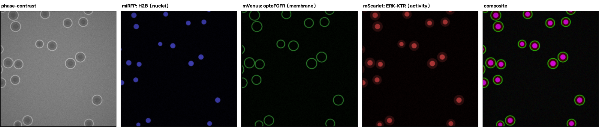
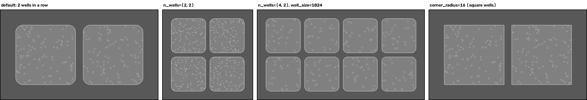
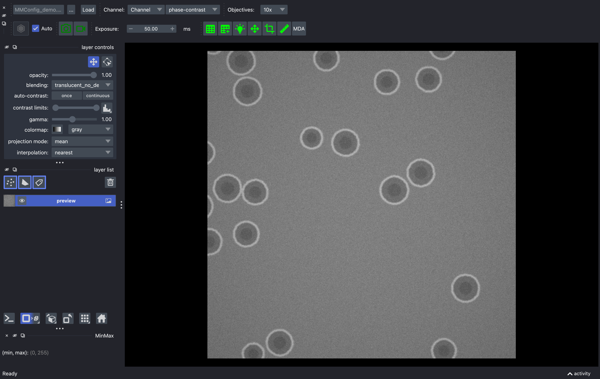
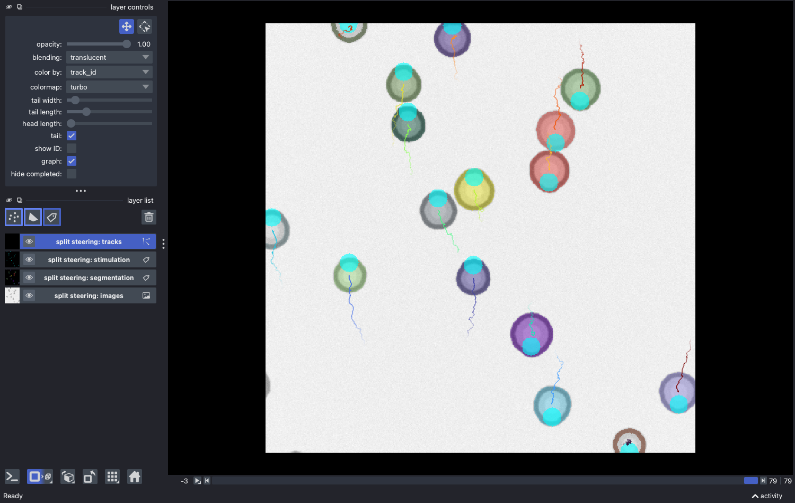

# virtual-microscope-teaching

A **minimal virtual microscope for learning and testing smart microscopy**: a simulated, light-responsive specimen behind the same device API ([pymmcore-plus](https://github.com/pymmcore-plus/pymmcore-plus) / Micro-Manager) that controls real microscopes.

> **The point:** the simulator models the *microscope–code interaction*, not the biology. It lets you develop, debug, teach, and test image-processing pipelines and microscope control logic in minutes on any laptop, then swap in a real microscope by changing only the configuration.

Code written against the virtual microscope runs unchanged on real hardware: `core.snapImage()`, `core.setConfig("Channel", ...)`, `core.setSLMImage(...)` are the identical calls in both worlds, because both implement the same Micro-Manager core API. That also makes this package a lightweight, deterministic stand-in for a real microscope in the test suites of acquisition and control software.

It began as a subset of the full [virtual-microscope](https://github.com/hinderling/virtual-microscope) research simulator and was rewritten for teaching: ~2,000 lines of Python, 4 ms per frame (250 fps) on a laptop. The NEUBIAS [training-resources](https://neubias.github.io/training-resources/) modules on smart microscopy build their exercises on it.

## Install

```bash
pip install virtual-microscope-teaching
```

With the napari GUI (interactive microscope control, results exploration):

```bash
pip install "virtual-microscope-teaching[gui]"
```

Requires Python ≥ 3.10, runs locally on any laptop. No hardware, no Micro-Manager device adapters, no C++. Everything is pure Python.

> The very first `load_microscope()` compiles the simulation physics (numba, about 5 s) and caches the result on disk, so every later load takes under a second, including after restarting Python. A full 100-cycle feedback experiment runs in ~2 s.

## Quick start: a complete feedback experiment

```python
import cv2, numpy as np
from vmteach import load_microscope, advance, detect_nuclei

core, sim = load_microscope("optogenetic", n_cells=20, seed=0)

for cycle in range(100):
    # ACQUIRE the nuclei channel: identical calls on real hardware
    core.setConfig("Channel", "miRFP")
    core.snapImage()
    img = core.getImage()

    # ANALYZE: find the cells (any segmentation works; detect_nuclei is
    # the built-in Otsu + contours reference detector)
    cells = detect_nuclei(img)

    # DECIDE: place a light spot above each cell (cells move toward light)
    mask = np.zeros_like(img)
    for cx, cy in cells:
        cv2.circle(mask, (cx, cy - 15), 11, 255, -1)

    # ACTUATE, identical calls on real hardware: upload the pattern,
    # then engage the stimulation light path to deliver it
    core.setSLMImage("SLM", mask)
    core.setConfig("Channel", "CyanStim")

    # let the sample respond (deterministic simulated time)
    advance(sim, seconds=1.0)
```

The cell population migrates upward, steered by your loop. Snap the `phase-contrast` channel to look at it.

More in [`examples/`](examples/): `01_photoactivation.py` (image → mask → stimulate → image, with the ERK-KTR readout), `02_napari_gui.py` (GUI and script drive the same core), `03_feedback_loop.py` (the loop above, step by step, plus per-object decisions and timing), `04_event_driven.py` (the same experiment as declarative useq-schema events), `05_letter_assembly.py` (steer 40 cells into a letter).

## The sample: the `optogenetic` backend

Cells expressing a light-sensitive receptor and a live activity readout. Blue light activates the receptor of exactly the illuminated cells; activated cells signal (visible in the reporter channel within ~5 s, reversible within ~20 s) and migrate toward the light.



Channels are named after the fluorophore, as on a real system:

| Channel | Labels | What you see |
|---|---|---|
| `phase-contrast` | — | overview, all cells |
| `miRFP` | H2B (nuclei) | bright nuclei on black: the detection channel |
| `mVenus` | optoFGFR | the membrane-bound optogenetic tool |
| `mScarlet` | ERK-KTR | activity reporter: bright nucleus = resting, dark nucleus = activated (full response ~5 s after a pulse, reversal ~20 s) |
| `CyanStim` | — | the blue stimulation light path; snapping it delivers the pulse and images the projected pattern |

`n_cells` is a density: cells per 10x field of view (512 x 512 um). Each 2048 um well is 4 x 4 fields, so the default population is 320 cells per well and every stage position looks like the first one.

### Adding a sample backend

`load_microscope(name)` looks the sample up in a registry, so new specimens plug in without touching the package:

```python
import vmteach
vmteach.register_backend("my_sample", MySim)   # MySim(**kwargs) -> sim object
core, sim = vmteach.load_microscope("my_sample")
```

A backend is a factory returning a sim object that implements the small bridge contract (`snap_frame()`, `step(dt)`, `reset(seed)`, `set_focal_plane(z)`, and the device-facing attributes used by `vmteach.bridge`). `vmteach.sim.OptoCellSim` is the reference implementation.

## Timing model (read this before designing experiments)

1. **Stimulation is gated on the light path**: `setSLMImage` only *uploads* the pattern, because the SLM modulates light that is not on yet. Switching to the `CyanStim` channel engages the stimulation LED and delivers the pattern (an impulse that *sets* cell velocity toward the light); switching to an imaging channel turns it off. One delivery per loop iteration, so the feedback loop frequency is the stimulation frequency, as in pulsed optogenetic protocols. Leaving the light engaged while time advances does not stimulate again: delivery is an impulse at the delivery events (the light-on transition and snaps in `CyanStim`), which is deliberate pulsed-protocol behavior. Snapping in `CyanStim` images the projected light itself (mask–sample alignment check).
2. **Stepped mode (default)**: simulated time advances only via `advance(sim, seconds=...)`. Same seed + same loop = identical result on every machine.
3. **Real-time mode**, `load_microscope(..., mode="realtime")`: the sample evolves in wall-clock time *while your code runs*, like on a real microscope. Your analysis latency becomes part of the experiment.

## API

| Function | Purpose |
|---|---|
| `load_microscope(backend, n_cells, seed, mode)` | Create the microscope → `(core, sim)` |
| `register_backend(name, factory)` | Register a new simulated sample |
| `advance(sim, seconds)` | Advance simulated time (stepped mode) |
| `detect_nuclei(img)` | Reference detector: nuclei centroids from the `miRFP` channel |
| `measure_activity(ktr_img, centroids)` | Per-cell pathway activity (0 to 1) from the `mScarlet` channel |
| `link_tracks(detections)` | Link per-frame detections into tracks (Hungarian assignment) |
| `overlay(img, mask)` | RGB visualization of a stimulation mask on an image |
| `letter_mask(char)` | Binary letter target for the assembly exercise |
| `vmteach.gui.launch_gui(core)` | napari + micro-manager control widgets on the core |
| `vmteach.gui.show_results(images, ...)` | Explore a finished experiment as napari layers |

`core` is a full `pymmcore-plus` core: stage (`setXYPosition`), objectives (`setState("Objective", ...)`), the five channels above, exposure, binning, SLM.

## Microscope geometry

The virtual microscope is built like a real one: a fixed camera behind an objective turret, over a sample larger than the field of view.

| Component | Model |
|---|---|
| Sample | square wells with rounded corners in a plastic slide; size, gap, corner radius, and layout are constructor arguments (`n_wells=2` for a row, `n_wells=(nx, ny)` for a plate-like grid). Default: two 2048 um wells side by side, pitch 2304 um. Stage (0, 0) is the centre of well 0 (`sim.well_positions` lists the others); `core.setXYPosition(x, y)` in um, travel limited like a stage with soft limits. The well wall is a hard boundary the cells collide with: visible in phase contrast (dark plastic, bright edge), a cell-free zone in fluorescence |
| Camera | fixed 512 x 512 sensor. Objectives change the pixel size and field of view, never the image size |
| Objectives | 4x (2.5 um/px, 1280 um field), 10x (1.0, 512), 20x (0.5, 256), 40x (0.25, 128), 60x (0.167, 85). `core.getPixelSizeUm()` reports them from the pixel-size presets in the `.cfg`, times the binning |
| Binning | `Camera` > `Binning` presets 1 / 2 / 4: the frame shrinks to 512/b and each output pixel sums b^2 sensor pixels, so the image gets b^2 brighter and saturates unless the exposure comes down, as on a real 8-bit camera |
| SLM / DMD | 512 x 512 pixels projected 1:1 onto the sensor at every objective (a perfectly calibrated projector). `sim.slm_affine` (2x3) models a misaligned projector for the DMD calibration exercise |
| Phase contrast | neutral mid-gray background; cells are slightly darker with a bright halo at the edge and a darker nucleus |



Rendering draws only the cells and well outlines in the field, straight at the camera resolution, so frames cost the same at 4x with 200 cells in view as at 60x with two, and the scene size is free.

## napari GUI

```python
from vmteach.gui import launch_gui
core, sim = load_microscope("optogenetic", mode="realtime")
viewer = launch_gui(core)   # napari + micro-manager widgets on the virtual scope
```



Snap, Live (~10 fps of crawling simulated cells), channel and objective dropdowns, exposure, MDA: every control issues the same core API calls your scripts make. The GUI and the script are two faces of one microscope. See the [GUI walkthrough](docs/gui_walkthrough.md) for the click-by-click tour, and `vmteach.gui.show_results(...)` to explore finished experiments (images, segmentation, stimulation masks, tracks) as napari layers:



## License

MIT, see [LICENSE](LICENSE). If you use this in teaching or research, please cite the FARO paper (see [CITATION.cff](CITATION.cff)).
