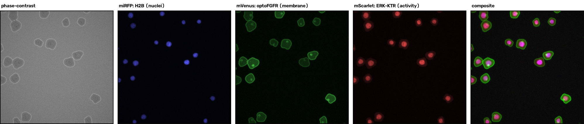
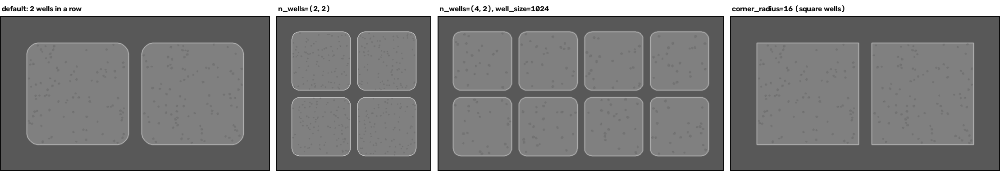
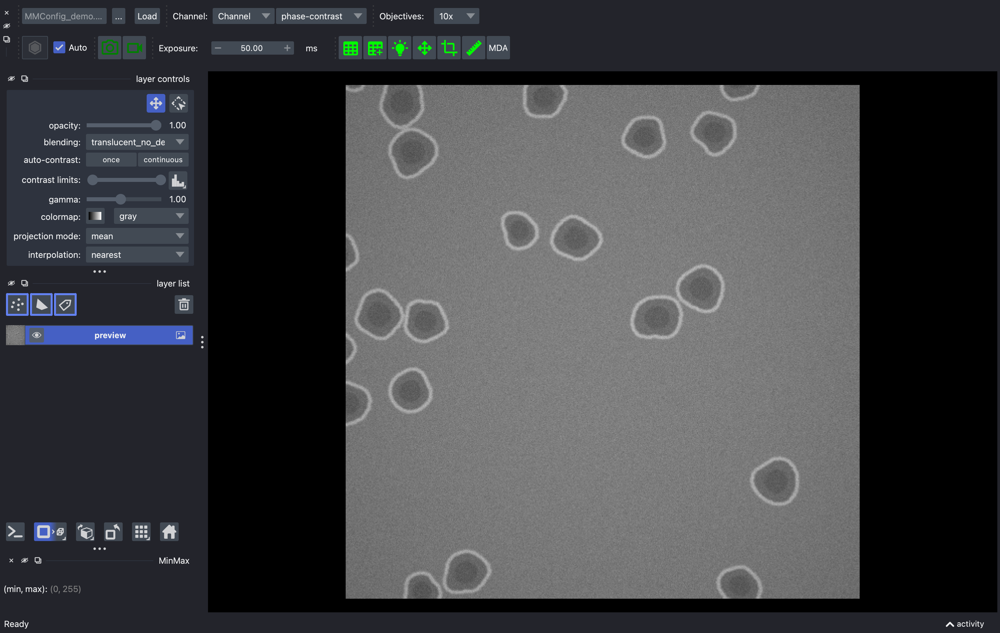
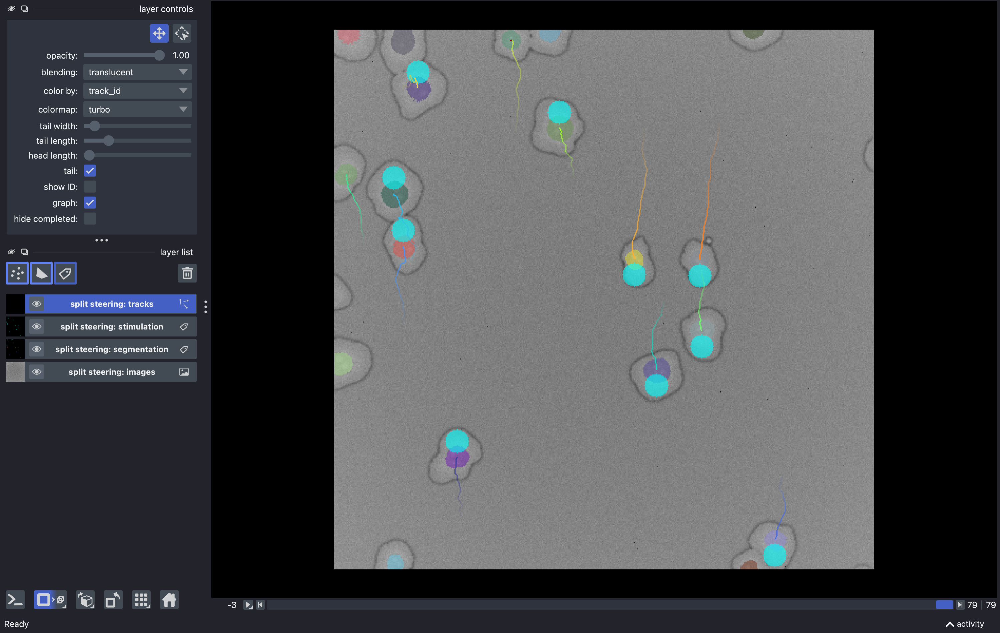

# virtual-microscope-teaching

A **minimal virtual microscope for learning and testing smart microscopy**: a simulated, light-responsive specimen behind the same device API ([pymmcore-plus](https://github.com/pymmcore-plus/pymmcore-plus) / Micro-Manager) that controls real microscopes.

> **The point:** the simulator models the *microscope–code interaction*, not the biology. It lets you develop, debug, teach, and test image-processing pipelines and microscope control logic in minutes on any laptop, then swap in a real microscope by changing only the configuration.

Code written against the virtual microscope runs unchanged on real hardware: `core.snapImage()`, `core.setConfig("Channel", ...)`, `core.setSLMImage(...)` are the identical calls in both worlds, because both implement the same Micro-Manager core API. That also makes this package a lightweight, deterministic stand-in for a real microscope in the test suites of acquisition and control software.

It began as a subset of the full [virtual-microscope](https://github.com/hinderling/virtual-microscope) research simulator and was rewritten for teaching: ~2,800 lines of Python, 5 to 10 ms per frame (100 to 200 fps) on a laptop. The NEUBIAS [training-resources](https://neubias.github.io/training-resources/) modules on smart microscopy build their exercises on it.

## Install

```bash
pip install git+https://github.com/hinderling/virtual-microscope-teaching
```

With the napari GUI (interactive microscope control, results exploration):

```bash
pip install "virtual-microscope-teaching[gui] @ git+https://github.com/hinderling/virtual-microscope-teaching"
```

(A PyPI release will follow once the pymmcore-plus version this package depends on is published; until then, installation is from GitHub.)

Requires Python ≥ 3.10, runs locally on any laptop. No hardware, no Micro-Manager device adapters, no C++. Everything is pure Python.

> The very first `load_microscope()` compiles the simulation physics (numba, about 5 s) and caches the result on disk, so every later load takes under a second, including after restarting Python. In stepped mode (`mode="stepped"`) a full 100-cycle feedback experiment computes in ~3 s.

## Quick start: a complete feedback experiment

```python
import time
import cv2, numpy as np
from vmteach import load_microscope
from vmteach.optogenetic import detect_nuclei

# the sample lives in wall-clock time (realtime, the default), like on a real microscope
core, sim = load_microscope("optogenetic", n_cells=20, seed=0)

for cycle in range(60):
    # ACQUIRE the nuclei channel: identical calls on real hardware
    core.setConfig("Channel", "miRFP")
    core.snapImage()
    img = core.getImage()

    # ANALYZE: find the cells (any segmentation works; detect_nuclei is
    # the built-in Otsu + contours reference detector)
    cells = detect_nuclei(img)

    # DECIDE: place a light spot above each cell (cells move toward light)
    mask = np.zeros_like(img)
    for cx, cy in cells:
        cv2.circle(mask, (cx, cy - 15), 11, 255, -1)

    # ACTUATE, identical calls on real hardware: upload the pattern,
    # then expose it with the stimulation light
    core.setSLMImage("SLM", mask)
    core.setConfig("Channel", "CyanStim")
    core.snapImage()

    # let the sample respond: the same line on real hardware
    time.sleep(1.0)
```

Within the minute the cell population migrates upward, steered by your loop. Snap the `phase-contrast` channel to look at it, or [watch it live in napari](#napari-gui). Apart from the `load_microscope` line, this is the script you would run on a real microscope.

More in [`examples/`](examples/): `01_photoactivation.py` (image → mask → stimulate → image, with the ERK-KTR readout), `02_napari_gui.py` (GUI and script drive the same core), `03_feedback_loop.py` (the loop above, step by step, plus per-object decisions and timing), `04_event_driven.py` (the same experiment as declarative useq-schema events), `05_letter_assembly.py` (steer a dense population into the letter N, with the simulation running 5x faster than real time). The examples run in real-time mode with napari-micromanager open, so every snap, channel switch and light pattern shows up live.

The activities of the NEUBIAS module *Smart microscopy feedback photomanipulation* are in [`notebooks/smart_microscopy_photomanipulation.ipynb`](notebooks/smart_microscopy_photomanipulation.ipynb): one notebook, run top to bottom, with napari open next to it (photoactivation and a first closed loop, steering and tracking, assembling cells into a letter).

## The sample: the `optogenetic` backend

Cells expressing a light-sensitive receptor and a live activity readout. Blue light activates the receptor of exactly the illuminated cells; activated cells signal (visible in the reporter channel within ~5 s, reversible within ~20 s) and migrate toward the light.

The cells crawl like fibroblasts instead of gliding: stochastic lamellipodial protrusions adhere to the substrate and pull the cell body forward, while the adhered rear is dragged along until it lets go (stick-slip), leaving thin retraction fibres on the substrate that trail behind the cell and fade. Resting cells are irregular, lumpy and mostly stuck; stimulated cells polarize toward the light, with a broad protrusive front, a trailing rear, and the nucleus lagging slightly behind the centre. Neighbours do not overlap: a membrane that meets another cell stops and conforms to it (contact inhibition), and a cell squeezed by a crowd pushes back, so dense groups pack like a monolayer instead of piling up.

The images are made to read like widefield microscopy while staying easy to segment: every channel is derived from a per-cell thickness profile (thick over the nucleus, thin at the lamellipodia), nuclei carry chromatin texture and nucleoli, the membrane-bound tool shows the whole cell with a subtle rim, a perinuclear Golgi and a few vesicles, expression varies from cell to cell within a band a plain threshold still handles, and the camera adds out-of-focus glow, slightly uneven illumination, an offset, a few hot pixels and shot noise. There is deliberately no photobleaching: the sample can be imaged indefinitely, so a training session never has to stop and reset it.



Channels are named after the fluorophore, as on a real system:

| Channel | Labels | What you see |
|---|---|---|
| `phase-contrast` | — | overview, all cells |
| `miRFP` | H2B (nuclei) | bright nuclei on black: the detection channel |
| `mVenus` | optoFGFR | the membrane-bound optogenetic tool |
| `mScarlet` | ERK-KTR | activity reporter: bright nucleus = resting, dark nucleus = activated (full response ~5 s after a pulse, reversal ~20 s) |
| `CyanStim` | — | the blue stimulation light path; snapping it delivers the pulse and images the projected pattern |

`n_cells` is a density: cells per 10x field of view (512 x 512 um). Each 2048 um well is 4 x 4 fields, so the default population is 320 cells per well and every stage position looks like the first one.

### Adding a sample backend

`load_microscope(name)` looks the sample up in a registry, so new specimens plug in without touching the package:

```python
import vmteach
vmteach.register_backend("my_sample", MySim)   # MySim(**kwargs) -> sim object
core, sim = vmteach.load_microscope("my_sample")
```

A backend is a factory returning a sim object that implements the small bridge contract (`snap_frame()`, `step(dt)`, `reset(seed)`, `set_focal_plane(z)`, and the device-facing attributes used by `vmteach.bridge`). `vmteach.optogenetic.OptoCellSim` is the reference implementation; put a new backend in its own subpackage next to it, together with the analysis helpers for its readouts.

## Timing model (read this before designing experiments)

1. **Stimulation needs an exposure, as on real hardware**: `setSLMImage` only *uploads* the pattern, and selecting the `CyanStim` channel only picks the blue LED. Light reaches the sample when the shutter opens: a snap (or live frames) in `CyanStim`, or `core.setShutterOpen(True)` with `CyanStim` selected. Each exposure delivers one impulse that *sets* cell velocity toward the light, so the feedback loop frequency is the stimulation frequency, as in pulsed optogenetic protocols; time passing between exposures does not stimulate again. The `CyanStim` snap also images the projected light itself (mask–sample alignment check).
2. **Real-time mode** (the default): the sample evolves in wall-clock time *while your code runs*, like on a real microscope. You wait with `time.sleep`, and your analysis latency becomes part of the experiment. This is what the examples use.
3. **Faster than real time**, `load_microscope(..., mode="realtime", speed=10)`: the sample evolves 10x faster than the wall clock, so slow biology (cells migrating for minutes) can be tested in seconds. Shorten your waits by the same factor (`time.sleep(1.0 / speed)`) to keep the experiment's timing; physics still runs in steps of at most 0.05 s, so the cells behave the same at any speed. Only the simulator offers this: on a real microscope, the biology sets the pace. Note that your code's run time does *not* shrink, so at high speed it costs proportionally more sample time.
4. **Stepped mode**, `load_microscope(..., mode="stepped")`: simulated time advances only via `advance(sim, seconds=...)`, never on its own. Same seed + same loop = identical result on every machine, which is what tests and figure scripts need. `sim.time` reports the simulated seconds in every mode.

## How it relates to pymmcore-plus

The virtual microscope *is* a pymmcore-plus microscope; only the devices behind it are simulated:

1. `core` is a `UniMMCore`, the pymmcore-plus core that also accepts devices written in Python. Every hardware call your script makes (`snapImage`, `setConfig`, `setXYPosition`, `setPosition` for focus, `setSLMImage`, MDA) is the standard pymmcore-plus API.
2. [`optogenetic.cfg`](src/vmteach/optogenetic.cfg) is a normal Micro-Manager configuration (channel presets, pixel sizes per objective, startup state), except that its device lines load Python device classes instead of C++ device adapters.
3. The device classes in `vmteach/devices/` implement the pymmcore-plus device interfaces (camera, XY and Z stage, state devices, shutter, SLM). They contain no simulation logic and forward to a small bridge.
4. The bridge drives the simulated sample (the *backend*). Backend methods such as `set_focal_plane(z)` are internal: they are how the simulated Z stage tells the sample where the focal plane is, never something your script calls.

Moving a script to a real microscope therefore changes little: replace `load_microscope(...)` with `CMMCorePlus()` + `loadSystemConfiguration("your_scope.cfg")`, make the channel and device names match your configuration, and wait with `time.sleep` (or the MDA engine) instead of `advance`. Real systems additionally need a calibrated camera-to-SLM mapping, an SLM of their own size (`core.getSLMWidth()`), and thresholds suited to their camera's bit depth.

## API

The top-level `vmteach` namespace is the simulator:

| Function | Purpose |
|---|---|
| `load_microscope(backend, n_cells, seed, mode, speed)` | Create the microscope → `(core, sim)` |
| `register_backend(name, factory)` | Register a new simulated sample |
| `advance(sim, seconds)` | Advance simulated time (stepped mode only; in realtime mode and on hardware you wait with `time.sleep`) |
| `run_experiment(fn)` | Run an experiment loop in the background, returning a `Run` handle (`stop()`, `sleep()`, `wait()`); keeps notebook and GUI live |
| `sim.reset(seed, n_cells=, base_radius=)` | Restore the initial sample, for bit-identical reruns; optionally with a new density or cell size, on the running microscope |
| `sim.speed` | Realtime mode: how many times faster than real time the sample evolves; settable while running |

`core` is a full `pymmcore-plus` core: stage (`setXYPosition`), focus (`setPosition`), objectives (`setState("Objective", ...)`), the five channels above, exposure, binning, SLM.

Each sample backend is a subpackage that also holds the analysis helpers for its readouts. `vmteach.optogenetic` (the simulated sample `OptoCellSim` plus reference analysis for its H2B and ERK-KTR labels) provides the helpers the exercises use. They take plain images, so they also run on a real sample labelled the same way:

| Function | Purpose |
|---|---|
| `detect_nuclei(img)` | Nuclei centroids from a nuclear-marker image (Otsu + contours) |
| `cn_ratio(ktr_img, nuclei_img, centroids)` | Cytoplasm-to-nucleus ratio of a translocation reporter, per cell |
| `measure_activity(ktr_img, nuclei_img, centroids)` | C/N ratio rescaled to pathway activity (0 to 1); calibrate `lo`/`hi` on real data |
| `link_tracks(detections)` | Link per-frame detections into tracks (Hungarian assignment) |
| `overlay(img, mask)` | RGB visualization of a stimulation mask on an image |
| `letter_mask(char)` | Binary letter target for the assembly exercise |

`vmteach.gui` adds the napari front end: `launch_gui(core)` (napari + micro-manager control widgets on the core; every snap lands in a layer named after its channel), `show_mask(viewer, mask, name)` (overlay a target shape or stimulation pattern as a labels layer, callable from a running experiment) and `show_results(images, ...)` (explore a finished experiment as napari layers).

## Microscope geometry

The virtual microscope is built like a real one: a fixed camera behind an objective turret, over a sample larger than the field of view.

| Component | Model |
|---|---|
| Sample | square wells with rounded corners in a plastic slide; size, gap, corner radius, and layout are constructor arguments (`n_wells=2` for a row, `n_wells=(nx, ny)` for a plate-like grid). Default: two 2048 um wells side by side, pitch 2304 um. Stage (0, 0) is the centre of well 0 (`sim.well_positions` lists the others); `core.setXYPosition(x, y)` in um, travel limited like a stage with soft limits. The well wall is a hard boundary the cells collide with: visible in phase contrast (dark plastic, bright edge), a cell-free zone in fluorescence |
| Camera | fixed 512 x 512 sensor. Objectives change the pixel size and field of view, never the image size |
| Objectives | 4x (2.5 um/px, 1280 um field), 10x (1.0, 512), 20x (0.5, 256), 40x (0.25, 128), 60x (0.167, 85). `core.getPixelSizeUm()` reports them from the pixel-size presets in the `.cfg`, times the binning |
| Binning | `Camera` > `Binning` presets 1 / 2 / 4: the frame shrinks to 512/b and each output pixel sums b^2 sensor pixels, so the image gets b^2 brighter and saturates unless the exposure comes down, as on a real 8-bit camera |
| SLM / DMD | 512 x 512 pixels projected 1:1 onto the sensor at every objective (a perfectly calibrated projector). `sim.slm_affine` (2x3) models a misaligned projector for the DMD calibration exercise |
| Phase contrast | neutral mid-gray background; cells darken with thickness, with a bright halo that is strong around thick parts and faint at thin protrusions; lighter nucleus with dark nucleoli and perinuclear granules; retraction fibres behind moving cells; a little static debris on the substrate |



Rendering draws only the cells and well outlines in the field, straight at the camera resolution, so frames cost the same at 4x with 200 cells in view as at 60x with two, and the scene size is free.

## napari GUI

```python
from vmteach import load_microscope, run_experiment
from vmteach.gui import launch_gui

core, sim = load_microscope("optogenetic", mode="realtime")
viewer = launch_gui(core)   # napari + micro-manager widgets on the virtual scope

def experiment(run):        # your feedback loop, unchanged
    for cycle in range(60):
        if run.stop_requested:
            break
        ...                  # acquire, analyze, decide, actuate
        run.sleep(1.0)      # wait; returns early on run.stop()

run = run_experiment(experiment)   # returns immediately; the viewer stays live
run.wait()                         # later: block until done (re-raises errors)
```

Each snap goes to a layer named after its channel (`miRFP`, `mScarlet`, `CyanStim`, ...), with fluorescence channels blended additively, so a loop that snaps several channels per cycle shows all of them rather than only the last. `show_mask(viewer, target, "target")` adds a mask on top, for example the shape the cells should assemble into. Live mode and MDAs keep napari-micromanager's own layers.

A plain `for` loop in a notebook cell would block the kernel, and with it the live viewer, until the loop ends. `run_experiment` runs the loop on a background thread instead (the same pattern as FARO's non-blocking `run_experiment`), so napari-micromanager shows every snap, channel switch and stimulation pattern while the experiment runs and the notebook stays usable. It only calls your function, so it drives a real microscope the same way. `run.wait()` keeps the GUI responsive when called from a plain script.



Snap, Live (~10 fps of crawling simulated cells), channel and objective dropdowns, exposure, MDA: every control issues the same core API calls your scripts make. The GUI and the script are two faces of one microscope. See the [GUI walkthrough](docs/gui_walkthrough.md) for the click-by-click tour, and `vmteach.gui.show_results(...)` to explore finished experiments (images, segmentation, stimulation masks, tracks) as napari layers:



## License

MIT, see [LICENSE](LICENSE). If you use this in teaching or research, please cite the FARO paper (also in [CITATION.cff](CITATION.cff)):

> Hinderling L, Landolt AE, Grädel B, Dubied L, Zahni C, Kwasny M, Bassi D, Frismantiene A, Lambert T, Dobrzyński M, Pertz O. Real-time feedback control microscopy for automation of optogenetic targeting. bioRxiv (2025). [doi:10.1101/2025.08.17.670729](https://doi.org/10.1101/2025.08.17.670729)
